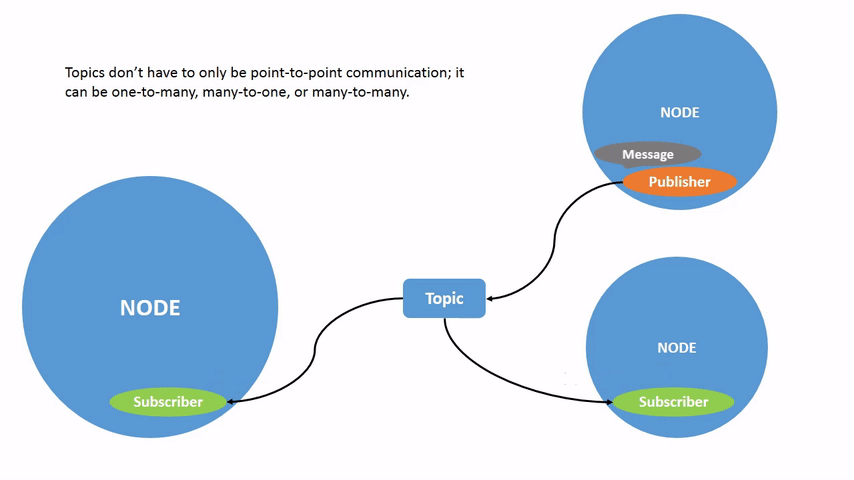

# ROS2 - Toolkit

## Basics

```powershell
ros2 run <package_name> <executable_name>
rqt_graph
ros2 interface show <type_name>
rqt #Open RQT GUI and can launch the console
ros2 pkg create --build-type ament_python python_parameters --dependencies rclpy
```

## Types for .srv, .msg & .action files

```powershell
bool
byte
char
float32, float64
int8, uint8
int16, uint16
int32, uint32
int64, uint64
string
```

## Creating a Workspace

A workspace is a directory containing ROS 2 packages. Before using ROS 2, it’s necessary to source your ROS 2 installation workspace in the terminal you plan to work in. This makes ROS 2’s packages available for you to use in that terminal.

You also have the option of sourcing an “overlay” – a secondary workspace where you can add new packages without interfering with the existing ROS 2 workspace that you’re extending, or “underlay”. Your underlay must contain the dependencies of all the packages in your overlay. Packages in your overlay will override packages in the underlay. It’s also possible to have several layers of underlays and overlays, with each successive overlay using the packages of its parent underlays.

- Best practice is to create a new directory for every new workspace. The name doesn’t matter, but it is helpful to have it indicate the purpose of the workspace.
- Another best practice is to put any packages in your workspace into the `src`
 directory.

Trivial Workspace config : 

```powershell
workspace_folder/
    src/
      package_1/
          CMakeLists.txt
          package.xml

      package_2/
          setup.py
          package.xml
          resource/package_2
      ...
      package_n/
          CMakeLists.txt
          package.xml
```

```powershell
colcon build --merge-install
colcon build --packages-select my_package
```

## Creating a package

A package can be considered a container for your ROS 2 code. If you want to be able to install your code or share it with others, then you’ll need it organized in a package. With packages, you can release your ROS 2 work and allow others to build and use it easily.

### Python

ROS 2 Python packages have their minimum required contents:

- `package.xml` file containing meta information about the package
- `setup.py` containing instructions for how to install the package
- `setup.cfg` is required when a package has executables, so `ros2 run` can find them
- `/<package_name>` - a directory with the same name as your package, used by ROS 2 tools to find your package, contains `__init__.py`

With file structure like that (simple) :

```powershell
my_package/
      setup.py
      package.xml
      resource/my_package
```

```powershell
ros2 pkg create --build-type ament_python <package_name> 
ros2 pkg create --build-type ament_python --node-name my_node my_package #Hello world package
ros2 pkg create --build-type ament_python python_parameters --dependencies rclpy
```

## Nodes

A node is a fundamental ROS 2 element that serves a single, modular purpose in a robotics system.

```powershell
ros2 node list
ros2 node info <node_name>
```

## Parameters

```powershell
ros2 param list
ros2 param get <node_name> <parameter_name>
ros2 param set <node_name> <parameter_name> <value>
ros2 param dump <node_name>
ros2 param load <node_name> <parameter_file>
ros2 run <package_name> <executable_name> --ros-args --params-file <file_name>
```

## Topics

Nodes publish information over topics, which allows any number of other nodes to subscribe to and access that information. In this tutorial you examined the connections between several nodes over topics using rqt_graph and command line tools. You should now have a good idea of how data moves around a ROS 2 system.



```powershell
ros2 topic list -t
ros2 topic echo <topic_name> #See published data
ros2 topic info <topic_name>
ros2 topic pub [--once, --rate x] <topic_name> <msg_type> '<args>' #Publish data onto topic
ros2 topic hz <topic_name>
```

## Services

Nodes can communicate using services in ROS 2. Unlike a topic - a one way communication pattern where a node publishes information that can be consumed by one or more subscribers - a service is a request/response pattern where a client makes a request to a node providing the service and the service processes the request and generates a response.

You generally don’t want to use a service for continuous calls; topics or even actions would be better suited.


```powershell
ros2 service type <service_name>
ros2 service list (-t)
ros2 service find <type_name>
ros2 service call <service_name> <service_type> <arguments>
```

## Custom .msg and .srv files

- .msg and .srv files are used as interfaces (see publisher/subscriber or service/client examples at the end)
- It is good practice to keep `.msg` and `.srv` files in their own directories within a package.
- .msg files :
    - define the type and name of variables inside e.g. : `int64 num [=default]`
- .srv file :
    - define the types and name of inputs and response e.g. :
    
    ```powershell
    int64 a [=default]
    int64 b [=default]
    int64 c [=default]
    ---
    int64 sum [=default]
    ```
    
- To convert the interfaces you defined into language-specific code (like C++ and Python) so that they can be used in those languages, add the following lines to `CMakeLists.txt`:
    
    ```makefile
    find_package(rosidl_default_generators REQUIRED)
    
    rosidl_generate_interfaces(${PROJECT_NAME}
      "msg/Num.msg"
      "srv/AddThreeInts.srv"
    )
    ```
    
    or
    
    ```makefile
    find_package(rosidl_default_generators REQUIRED)
    
    set(msg_files 
      "msg/yourMsgName.msg"
    )
    set(srv_files
    	"srv/YourServiceName.srv"
    )
    rosidl_generate_interfaces(${PROJECT_NAME} #Generate the message and server
      ${msg_files}
      ${srv_files}
    )
    ament_export_dependencies(rosidl_default_runtime) #make sure you export the message runtime dependency
    ```
    
    **By adding the .msg and .srv files manually, we make sure that CMake knows when it has to reconfigure the project after you add other .msg and .srv files.**
    
- Because the interfaces rely on `rosidl_default_generators` for generating language-specific code, you need to declare a dependency on it. Add the following lines to `package.xml` :
    
    ```makefile
    <build_depend>rosidl_default_generators</build_depend>
    
    <exec_depend>rosidl_default_runtime</exec_depend>
    
    <member_of_group>rosidl_interface_packages</member_of_group>
    ```
    
- While best practice is to declare interfaces in dedicated interface packages, sometimes it can be convenient to declare, create and use an interface all in one package.

## Actions

Actions are like services that allow you to execute long running tasks, provide regular feedback, and are cancelable.

A robot system would likely use actions for navigation. An action goal could tell a robot to travel to a position. While the robot navigates to the position, it can send updates along the way (i.e. feedback), and then a final result message once it’s reached its destination.


```powershell
ros2 action list -t
ros2 action info <action_name>
ros2 action send_goal <action_name> <action_type> <values> [--feedback]
```

Actions are defined in `.action` files of the form:

```powershell
# Request
---
# Result
---
# Feedback
```

- A *request* message is sent from an action client to an action server initiating a new goal.
- A *result* message is sent from an action server to an action client when a goal is done.
- *Feedback* messages are periodically sent from an action server to an action client with updates about a goal.

An instance of an action is typically referred to as a *goal.*

### Custom define of an action ‘type’

A package containing the actions definition is usually structured as follow :

```powershell
workspace_folder/
    src/
      package_name/
          CMakeLists.txt
          package.xml
					action/
						example.action
```

By convention, action types will be prefixed by their package name and the word `action` . So when we want to refer to our new action, it will have the full name `action_tutorials_interfaces/action/Fibonacci`.

- Once you have edited the file `example.action` for example as follow :

```powershell
int32 order
---
int32[] sequence
---
int32[] partial_sequence
```

- Edit the `CMakeLists.txt` file before the `ament_package()` line :

```powershell
find_package(rosidl_default_generators REQUIRED)

rosidl_generate_interfaces(${PROJECT_NAME}
  "action/example.action"
)
```

- And add the dependencies to the `package.xml`  file :

```xml
<buildtool_depend>rosidl_default_generators</buildtool_depend>

<depend>action_msgs</depend>

<member_of_group>rosidl_interface_packages</member_of_group>
```

- Finally build the package using `colcon build` command.

## Severity types for log console

There is no exact standard for what each level indicates, but it’s safe to assume that:

- `Fatal` messages indicate the system is going to terminate to try to protect itself from detriment.
- `Error` messages indicate significant issues that won’t necessarily damage the system, but are preventing it from functioning properly.
- `Warn` messages indicate unexpected activity or non-ideal results that might represent a deeper issue, but don’t harm functionality outright.
- `Info` messages indicate event and status updates that serve as a visual verification that the system is running as expected.
- `Debug` messages detail the entire step-by-step process of the system execution.

The default level is `Info`. You will only see messages of the default severity level and more-severe levels.

Normally, only `Debug` messages are hidden because they’re the only level less severe than `Info`.

## Launch

```powershell
ros2 launch <package_name> <launch_file.py>
```

```python
# turtlesim/launch/multisim.launch.py

from launch import LaunchDescription
import launch_ros.actions

def generate_launch_description():
    return LaunchDescription([
        launch_ros.actions.Node(
            namespace= "turtlesim1", package='turtlesim', executable='turtlesim_node', output='screen'),
        launch_ros.actions.Node(
            namespace= "turtlesim2", package='turtlesim', executable='turtlesim_node', output='screen'),
    ])
```

## Recording and Playing back data

You can record data passed on topics in your ROS 2 system using the `ros2 bag`
command. Whether you’re sharing your work with others or introspecting on your own experiments, it’s a great tool to know about.

```powershell
ros2 bag record [-o name] <topic_name> [<topic_name> ...] # Create a database to record infos
ros2 bag info <bag_file_name>
ros2 bag play <bag_file_name>
```

## Setting parameters

When making your own nodes you will sometimes need to add parameters that can be set from the launch file.

- Optionally, you can set a descriptor for the parameter. Descriptors allow you to specify a text description of the parameter and parameters constraints, like making it read-only, specifying a range, etc.
- See the basic node creation with parameters example

## Basics code examples

In order to create new modules or nodes it is important to always :

- List dependancies in **package.xml :**
    
    ```python
    <exec_depend>rclpy</exec_depend>
    <exec_depend>std_msgs</exec_depend>
    ```
    
- Add entry points in **setup.py** :
    
    ```python
    entry_points={
            'console_scripts': [
                    'talker = py_pubsub.publisher_member_function:main',
    								...,
            ],
    },
    ```
    

### Basic Publisher

```python
import rclpy
from rclpy.node import Node

from std_msgs.msg import String

class MinimalPublisher(Node):

    def __init__(self):
        super().__init__('minimal_publisher') # Call constructor of mother class
        self.publisher_ = self.create_publisher(String, 'topic', 10) # Define the type of the communication, the name of the topic and the buffer size
        timer_period = 0.5  # seconds
        self.timer = self.create_timer(timer_period, self.timer_callback) # Define a timer to send data
        self.i = 0

    def timer_callback(self):
        msg = String()
        msg.data = 'Hello World: %d' % self.i
        self.publisher_.publish(msg)
        self.get_logger().info('Publishing: "%s"' % msg.data)
        self.i += 1

def main(args=None):
    rclpy.init(args=args)

    minimal_publisher = MinimalPublisher()

    rclpy.spin(minimal_publisher)

    # Destroy the node explicitly
    # (optional - otherwise it will be done automatically
    # when the garbage collector destroys the node object)
    minimal_publisher.destroy_node()
    rclpy.shutdown()

if __name__ == '__main__':
    main()
```

### Basic Subscriber

```python
import rclpy
from rclpy.node import Node

from std_msgs.msg import String

class MinimalSubscriber(Node):

    def __init__(self):
        super().__init__('minimal_subscriber')
        self.subscription = self.create_subscription( # Subscribe to a Topic
            String,
            'topic',
            self.listener_callback,
            10)
        self.subscription  # prevent unused variable warning

    def listener_callback(self, msg):
        self.get_logger().info('I heard: "%s"' % msg.data)

def main(args=None):
    rclpy.init(args=args)

    minimal_subscriber = MinimalSubscriber()

    rclpy.spin(minimal_subscriber)

    # Destroy the node explicitly
    # (optional - otherwise it will be done automatically
    # when the garbage collector destroys the node object)
    minimal_subscriber.destroy_node()
    rclpy.shutdown()

if __name__ == '__main__':
    main()
```

### Basic Service

```python
from example_interfaces.srv import AddTwoInts

import rclpy
from rclpy.node import Node

class MinimalService(Node):

    def __init__(self):
        super().__init__('minimal_service')
        self.srv = self.create_service(AddTwoInts, 'add_two_ints', self.add_two_ints_callback)

    def add_two_ints_callback(self, request, response):
        response.sum = request.a + request.b
        self.get_logger().info('Incoming request\na: %d b: %d' % (request.a, request.b))

        return response

def main(args=None):
    rclpy.init(args=args)

    minimal_service = MinimalService()

    rclpy.spin(minimal_service)

    rclpy.shutdown()

if __name__ == '__main__':
    main()
```

### Basic client

```python
import sys

from example_interfaces.srv import AddTwoInts
import rclpy
from rclpy.node import Node

class MinimalClientAsync(Node):

    def __init__(self):
        super().__init__('minimal_client_async')
        self.cli = self.create_client(AddTwoInts, 'add_two_ints')
        while not self.cli.wait_for_service(timeout_sec=1.0):
            self.get_logger().info('service not available, waiting again...')
        self.req = AddTwoInts.Request()

    def send_request(self):
        self.req.a = int(sys.argv[1])
        self.req.b = int(sys.argv[2])
        self.future = self.cli.call_async(self.req)

def main(args=None):
    rclpy.init(args=args)

    minimal_client = MinimalClientAsync()
    minimal_client.send_request()

    while rclpy.ok():
        rclpy.spin_once(minimal_client)
        if minimal_client.future.done():
            try:
                response = minimal_client.future.result()
            except Exception as e:
                minimal_client.get_logger().info(
                    'Service call failed %r' % (e,))
            else:
                minimal_client.get_logger().info(
                    'Result of add_two_ints: for %d + %d = %d' %
                    (minimal_client.req.a, minimal_client.req.b, response.sum))
            break

    minimal_client.destroy_node()
    rclpy.shutdown()

if __name__ == '__main__':
    main()
```

### Basic parameters setting

```python
import rclpy
import rclpy.node

class MinimalParam(rclpy.node.Node):
    def __init__(self):
        super().__init__('minimal_param_node')
        timer_period = 2  # seconds
        self.timer = self.create_timer(timer_period, self.timer_callback)

				[from rcl_interfaces.msg import ParameterDescriptor
	      my_parameter_descriptor = ParameterDescriptor(description='This parameter is mine!')]
        self.declare_parameter('my_parameter', 'world'[,my_parameter_descriptor]) #declare_parameter('name', value, [descriptor])

    def timer_callback(self):
        my_param = self.get_parameter('my_parameter').get_parameter_value().string_value

        self.get_logger().info('Hello %s!' % my_param)

        my_new_param = rclpy.parameter.Parameter(
            'my_parameter',
            rclpy.Parameter.Type.STRING,
            'world'
        )
        all_new_parameters = [my_new_param]
        self.set_parameters(all_new_parameters)

def main():
    rclpy.init()
    node = MinimalParam()
    rclpy.spin(node)

if __name__ == '__main__':
    main()
```
